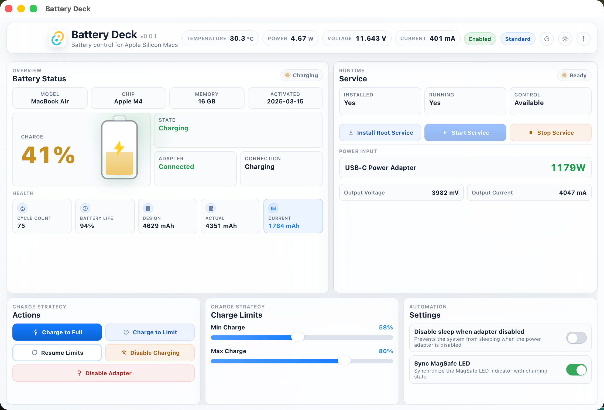

# Battery Deck

[简体中文](README.zh-CN.md)

Battery Deck is a macOS battery charge management app for Apple Silicon Macs.  
It combines a native Tauri desktop app, a privileged helper daemon, and a compact dashboard for charge limits, adapter control, live metrics, and battery health.

> Status: active local project, not notarized, intended for advanced macOS users comfortable with privileged helper installation.

## Highlights

- Charge strategy controls: charge to full, charge to limit, resume limits, disable charging, disable adapter
- Adjustable minimum and maximum charge thresholds
- Live battery telemetry: temperature, power, voltage, current, charging state
- Battery health overview: cycle count, health percentage, design/actual/current capacity
- Charger and device information: adapter name, wattage, model, chip, memory, activation date
- Tray menu shortcuts for common actions
- Built-in service diagnostics and helper log viewer
- Light, dark, and follow-system themes
- Chinese and English UI

## Why This Project Exists

Battery Deck is built for users who want direct battery charge control on Apple Silicon Macs without relying on a cloud service, subscription model, or Electron stack.

The app uses a privileged helper because some SMC-related operations require elevated access. The GUI stays unprivileged; only the helper handles hardware-level actions.

## Screenshots

### English UI



## Core Features

### Charge Management

- Charge to full
- Charge to limit
- Resume standard limit mode
- Disable charging
- Disable or enable the power adapter

### Monitoring

- Real-time battery telemetry
- Health snapshot and capacity statistics
- Charger voltage and current details
- Device hardware summary

### Service Tooling

- Install privileged helper service
- Start and stop service
- View helper logs
- Clear logs from the UI

## Project Structure

```text
battery-deck-tauri/
├── src/                         # Frontend (HTML, CSS, JS)
│   ├── index.html
│   ├── main.js
│   ├── i18n.js
│   └── styles.css
├── src-tauri/                   # Rust backend and helper
│   ├── src/
│   │   ├── main.rs
│   │   ├── lib.rs
│   │   ├── battery.rs
│   │   ├── helper.rs
│   │   ├── service.rs
│   │   ├── smc.rs
│   │   └── bin/
│   │       └── battery-helper.rs
│   ├── Cargo.toml
│   └── tauri.conf.json
├── scripts/
│   ├── restart-dev.sh
│   └── package-release.sh
└── package.json
```

## Architecture

```text
Tauri Frontend (HTML/CSS/JS)
        │
        │ invoke() / events
        ▼
Rust Tauri Backend (lib.rs)
        │
        │ Unix socket + JSON protocol
        ▼
Privileged Helper Daemon (battery-helper)
        │
        ▼
Apple SMC / system power control
```

### Main Components

- `src/main.js`: frontend state, DOM updates, menus, modal handling, Tauri invokes
- `src-tauri/src/lib.rs`: Tauri commands, tray behavior, polling, app lifecycle
- `src-tauri/src/battery.rs`: battery, charger, and system info probing/parsing
- `src-tauri/src/helper.rs`: privileged daemon, control logic, runtime state, logs
- `src-tauri/src/service.rs`: helper installation, launchd integration, IPC client
- `src-tauri/src/smc.rs`: Apple SMC bindings and charge control primitives

## Requirements

- macOS on Apple Silicon
- Rust stable
- Node.js 18+
- A user willing to authorize a privileged helper install when charge control is needed

## Development

Install dependencies:

```bash
npm install
```

Start the app for development:

```bash
./scripts/restart-dev.sh
```

If you changed helper installation or helper binary behavior and need to reinstall the root helper:

```bash
./scripts/restart-dev.sh --reinstall-root-helper
```

## Build

Create release artifacts:

```bash
./scripts/package-release.sh
```

Artifacts are written to `release-artifacts/`.
If `TAURI_SIGNING_PRIVATE_KEY` is set, the script also generates updater artifacts and `latest.json`. Without that key, it only builds the local `.app`, `.zip`, and `.dmg`.

Create and publish a full GitHub release:

```bash
export TAURI_SIGNING_PRIVATE_KEY="$(cat /path/to/tauri.key)"
export TAURI_SIGNING_PRIVATE_KEY_PASSWORD="your-password" # if the key uses one
./scripts/release.sh 0.0.2
```

The updater public key belongs in `src-tauri/tauri.conf.json`. The matching private key must never be committed; keep it in your shell environment or CI secrets.

## Installation Notes

This app is currently not notarized. On a clean macOS machine, Gatekeeper may block it on first launch.

Possible ways to open it:

1. Remove quarantine attributes:

```bash
xattr -cr /Applications/Battery\ Deck.app
```

2. Right-click the app and choose `Open`
3. Open `System Settings > Privacy & Security` and allow the blocked app

## Helper Upgrade Behavior

The GUI app and the privileged helper are versioned separately in practice.

- Updating the app does not automatically replace an already installed root helper
- Reinstalling the helper is required when the helper binary changes
- The project intentionally keeps helper service identifiers and install paths stable to preserve upgrade compatibility

In development, use:

```bash
./scripts/restart-dev.sh --reinstall-root-helper
```

In a production-style workflow, the app should detect an outdated installed helper and prompt the user to reinstall or update it with administrator approval.

## Logging

Battery Deck exposes helper logs in the UI.

- Logs are stored by the helper
- Entries include readable local timestamps
- The log modal supports refresh and clear actions
- Newest entries are shown first in the UI

## Known Limitations

- Apple Silicon only
- Requires a privileged helper for hardware-level battery control
- Not notarized yet
- No built-in updater yet
- Helper/service upgrade flow is functional but not yet polished as a user-facing update system

## Roadmap

- Better helper version/update detection
- Polished first-run installation flow
- More explicit diagnostics and health reporting
- Better release automation and notarization workflow
- Improved screenshots and public documentation

## Contributing

This repository is still evolving quickly, so large refactors should start with an issue or discussion first.

If you contribute:

- Keep helper and SMC changes narrow and auditable
- Prefer small, testable Rust changes
- Preserve existing UI conventions unless doing an intentional design pass
- Be careful with service labels, runtime paths, and privileged install behavior

## License

[GPL v3](LICENSE)

## Acknowledgements

- [Battery-Toolkit](https://github.com/mhaeuser/Battery-Toolkit) for the original inspiration
