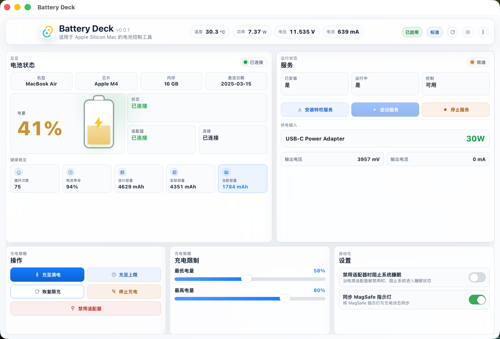

# Battery Deck

[English](README.md)

Battery Deck 是一款面向 Apple Silicon Mac 的 macOS 电池充电管理工具。  
它结合了原生 Tauri 桌面应用、特权 helper 守护进程，以及用于充电限制、适配器控制、实时数据和电池健康信息的紧凑仪表盘。

> 状态：当前为活跃本地项目，尚未 notarize，适合能够接受安装特权 helper 的高级 macOS 用户。

## 亮点

- 充电策略控制：充满、充到上限、恢复限制、停止充电、关闭适配器
- 可调的最低和最高充电阈值
- 实时电池遥测：温度、功率、电压、电流、充电状态
- 电池健康概览：循环次数、健康度、设计/实际/当前容量
- 充电器与设备信息：适配器名称、功率、机型、芯片、内存、激活日期
- 菜单栏托盘快捷操作
- 内置服务诊断与 helper 日志查看
- 支持浅色、深色和跟随系统主题
- 提供中英文界面

## 项目目的

Battery Deck 面向希望在 Apple Silicon Mac 上直接控制电池充电行为的用户，不依赖云服务、订阅模式或 Electron 技术栈。

应用使用特权 helper 的原因是部分 SMC 相关操作需要提升权限。GUI 本身保持非特权，仅由 helper 执行硬件层控制。

## 截图

### 中文界面



## 开发

安装依赖：

```bash
npm install
```

启动开发环境：

```bash
./scripts/restart-dev.sh
```

如果你修改了 helper 安装逻辑或 helper 二进制并需要重新安装 root helper：

```bash
./scripts/restart-dev.sh --reinstall-root-helper
```

## 构建

生成发布产物：

```bash
./scripts/package-release.sh
```

产物会写入 `release-artifacts/`。

## 说明

- Apple Silicon only
- 硬件级电池控制依赖特权 helper
- 当前尚未 notarize
- 尚未内置自动更新器

完整英文说明见 [README.md](README.md)。
